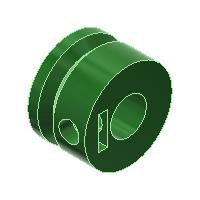
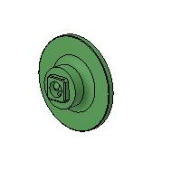

# ED00 Labeler

## Manual milk labeler, designed by EDMS ([web site](https://www.ed-ms.fr))

*If you think this design is useful, do not hesitate to **donate** :wink:, see [company web site](https://www.ed-ms.fr) for that, thanks :+1:*

*If you find some mistakes or improvement on this design :monocle_face:, please create an **Issue** or a **Pull request** on this repository.*

This repository contains :
- STL files of 3D printed parts
- image files of 3D printed part
- PDF 3D file to see where each part is located

## 3D printed parts
- Total of ~1kg of plastic filament required
- ~60 hours of printing in total (using a PRUSA MK3S printer)
- Minimum printing volume requested : 240mm x 205mm x 152mm

### 3D printing recommended parameters
- Material : PETG
- Layers height : 0.3mm
- Part filling : 20%
- No suppport required (except on 001001)

### Update 28th March 2023 : add design alternative (ED00-1) :
With initial design (ED00), labels gluing with milk is possible but it is a quite long process (it is necessary to turn very slowly). Labels gluing with glue is also possible (and quicker) but it is difficult to move the label after gluing.
With alternative design (ED00-1), labels gluing with milk is not possible but labels gluing with glue is very quick and it is possible to move the labels after gluing (to align it).

### 3D printing parts
| N° | Reference  |Image            | Qty ED00 | Qty ED00-1 |
| -- | ---------- | ---             | -------- | ---------- |
| 1  | 002001     |  | 1        | 1          |
| 2  | 002002     |  | 1        | 0          |
| 2  | 002002-1   || 0        | 1          |
| 3  | 002003     |  | 1        | 1          |
| 4  | 002004     |  | 1        | 1          |
| 5  | 001001     |  | 1        | 1          |
| 6  | 001002     |  | 1        | 1          |
| 7  | 001003     |  | 1        | 1          |
| 8  | 001004     |  | 1        | 1          |
| 9  | 001005     |  | 1        | 1          |
| 10 | 001006     |  | 2        | 1          |
| 11 | 001007     |  | 2        | 1          |
| 12 | 001008     |  | 1        | 1          |
| 13 | 001009     |  | 1        | 1          |
| 14 | 001010     |  | 1        | 0          |
| 15 | 001011     |  | 1        | 1          |
| 16 | 001012     |  | 1        | 0          |
| 17 | 001012-1   || 0        | 1          |
| 18 | 001013     |  | 2        | 0          |
| 19 | 001013-1   || 0        | 3          |
| 20 | 001014     |  | 1        | 0          |
| 21 | 001014-1   || 0        | 1          |
| 22 | 001015     |  | 1        | 0          |
| 23 | 001016     |  | 1        | 0          |
| 24 | 001017     |  | 1        | 1          |
| 25 | 001018     |  | 4        | 1          |
| 26 | 101010     |  | 2        | 1          |
| 27 | 101013     |  | 2        | 1          |
| 28 | 101035     |  | 6        | 1          |
| 29 | 111043     |  | 1        | 1          |
| 30 | 111044     |  | 1        | 1          |
| 31 | 111047     |  | 0        | 7          |
| 32 | 111048     |  | 0        | 1          |
| 33 | 111049     |  | 0        | 1          |
| 34 | 131026     |  | 1        | 1          |
| 35 | 131027     |  | 1        | 1          |
| 36 | 131057     |  | 0        | 1          |
| 37 | 131060     |  | 0        | 1          |

### Other parts
| N° | Designation                                                | Qty ED00 | Qty ED00-1   | Proposed supplier                     | Note      |
| -- | ---------------------------------------------------------- | -------- | ------------ | ------------------------------------- | ----------|
| 1  | Hex socket button head, flanged screw M4x16                | 29       | 25           | www.visseriefixations.fr/             |           |
| 2  | Hex socket button head, screw                              | 4x M4x30 | 4x M4x35     | www.visseriefixations.fr/             |for 1009   |
| 3  | Headless, hex socket screw M4x6                            | 11       | 13           | www.visseriefixations.fr/             |           |
| 4  | Hex head screw M6x30                                       | 4        | 4            | www.visseriefixations.fr/             |           |
| 5  | Hex head screw M6x45                                       | 3        | 3            | www.visseriefixations.fr/             |           |
| 6  | Square nut M4x7x2                                          | 30       | 32           | www.visseriefixations.fr/             |           |
| 7  | Self locking hex nut M4                                    | 16       | 12           | www.visseriefixations.fr/             |           |
| 8  | Hex nut M6                                                 | 8        | 8            | www.visseriefixations.fr/             |           |
| 9  | Self locking hex nut M6                                    | 2        | 2            | www.visseriefixations.fr/             |for springs|
| 10 | Rigid flange coupling Ø8                                   | 3        | 2            | eBay or Aliexpress or www.ed-ms.fr    |           |
| 11 | Orange foam roll Ø45x25mm length 60mm                      | 3        | 3            | www.ed-ms.fr                          |           |
| 12 | Spring Ø8.63mm ext, free length 40mm, wire diameter 0.63mm | 2        | 2            | fr.rs-online.com/web/ or www.ed-ms.fr |ref 751512 |
| 13 | Round belt Ø3mm PU weldable #1                             | 220mm    | 220mm        | www.fiamag.com or www.ed-ms.fr        |           |
| 14 | Round belt Ø3mm PU weldable #2                             | 410mm    | 360mm        | www.fiamag.com or www.ed-ms.fr        |           |
| 15 | Round belt Ø3mm PU weldable #3                             | 0        | 350mm        | www.fiamag.com or www.ed-ms.fr        |           |
| 16 | O Ring EPDM70 Ø15,47x3.53                                  | 78       | 78           | www.123roulement.com or www.ed-ms.fr  |           |
| 17 | Flange ring IGUS GFM-0810-11                               | 17       | 17           | www.igus.fr or www.ed-ms.fr           |           |
| 18 | Aluminium rod AWMP-08 or tube Ø8mm                         | 185mm x2 | 185mm x1     | www.igus.fr or www.ed-ms.fr           |           |
| 19 | Aluminium rod AWMP-08 or tube Ø8mm                         | 80mm x1  | 80mm x1      | www.igus.fr or www.ed-ms.fr           |           |
| 20 | Aluminium rod AWMP-08 or tube Ø8mm                         | 260mm x1 | 265mm x1     | www.igus.fr or www.ed-ms.fr           |           |
| 21 | Aluminium rod AWMP-08 or tube Ø8mm                         | 160mm x1 | 160mm x1     | www.igus.fr or www.ed-ms.fr           |           |
| 22 | Aluminium rod AWMP-08 or tube Ø8mm                         | 232mm x1 | 235mm x2     | www.igus.fr or www.ed-ms.fr           |           |
| 23 | Aluminium tube Ø8mm length 30mm                            | 1        | 1            | www.igus.fr or www.ed-ms.fr           |for 1009   |
| 24 | Stainless steel axis Ø2.5mm length 130mm                   | 1        | 1            | www.igus.fr or www.ed-ms.fr           |for 111044 |
