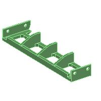

# ED00 Labeler

Manual milk labeler designed by EDMS ([web site](https://www.ed-ms.fr))

## 3D printed parts

### 3D printing recommended parameters
- Material : PETG
- Layers height : 0.3mm
- Number of perimeters : 2 mini
- Part filling : 20%
- No suppport (except on 001001)

### 3D printing parts
| N° | Reference  |Image          | Qty |
| -- | ---------- | ---           | --- |
| 1  | 002001     || 1   |
| 2  | 002002     || 1   |
| 3  | 002003     || 1   |
| 4  | 002004     || 1   |
| 5  | 001001     || 1   |
| 6  | 001002     || 1   |
| 7  | 001003     || 1   |
| 8  | 001004     || 1   |
| 9  | 001005     || 1   |
| 10 | 001006     || 2   |
| 11 | 001007     || 2   |
| 12 | 001008     || 1   |
| 13 | 001009     || 1   |
| 14 | 001010     || 1   |
| 15 | 001011     || 1   |
| 16 | 001012     || 1   |
| 17 | 001013     || 2   |
| 18 | 001014     || 1   |
| 19 | 001015     || 1   |
| 20 | 001016     || 1   |
| 21 | 001017     || 1   |
| 22 | 001018     || 4   |
| 23 | 101010     || 2   |
| 24 | 101013     || 2   |
| 25 | 101035     || 6   |
| 26 | 111043     || 1   |
| 27 | 111044     || 1   |
| 28 | 131026     || 1   |
| 29 | 131027     || 1   |
