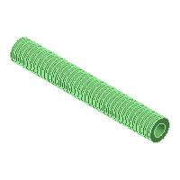

# ED00 Labeler

## Manual milk labeler, designed by EDMS ([web site](https://www.ed-ms.fr))

*If you think this design is useful, do not hesitate to **donate** :wink:, see [company web site](https://www.ed-ms.fr) for that, thanks :+1:*

*If you find some mistakes or improvement on this design :monocle_face:, please create an **Issue** or a **Pull request** on this repository.*

This repository contains :
- STL files of 3D printed parts
- image files of 3D printed part
- PDF 3D file to see where each part is located

## 3D printed parts
- Total of ~1.2kg of plastic filament required
- ~60 hours of printing in total (using a PRUSA MK3S printer)
- Minimum printing volume requested : 240mm x 205mm x 152mm

### 3D printing recommended parameters
- Material : PETG
- Layers height : 0.3mm
- Part filling : 20%
- No suppport required (except on 001001)

### 3D printing parts
| N° | Reference  |Image          | Qty |
| -- | ---------- | ---           | --- |
| 1  | 002001     || 1   |
| 2  | 002002     || 1   |
| 3  | 002003     || 1   |
| 4  | 002004     || 1   |
| 5  | 001001     || 1   |
| 6  | 001002     || 1   |
| 7  | 001003     || 1   |
| 8  | 001004     || 1   |
| 9  | 001005     || 1   |
| 10 | 001006     || 2   |
| 11 | 001007     || 2   |
| 12 | 001008     || 1   |
| 13 | 001009     || 1   |
| 14 | 001010     || 1   |
| 15 | 001011     || 1   |
| 16 | 001012     || 1   |
| 17 | 001013     || 2   |
| 18 | 001014     || 1   |
| 19 | 001015     || 1   |
| 20 | 001016     || 1   |
| 21 | 001017     || 1   |
| 22 | 001018     || 4   |
| 23 | 101010     || 2   |
| 24 | 101013     || 2   |
| 25 | 101035     || 6   |
| 26 | 111043     || 1   |
| 27 | 111044     || 1   |
| 28 | 131026     || 1   |
| 29 | 131027     || 1   |

### Other parts
| N° | Designation                                                | Qty | Proposed supplier                     | Note      |
| -- | ---------------------------------------------------------- | --- | ------------------------------------- | ----------|
| 1  | Hex socket button head, flanged screw M4x16                | 29  | www.visseriefixations.fr/             |           |
| 2  | Hex socket button head, flanged screw M4x30                | 4   | www.visseriefixations.fr/             |for 1009   |
| 3  | Headless, hex socket screw M4x6                            | 11  | www.visseriefixations.fr/             |           |
| 4  | Hex head screw M6x30                                       | 4   | www.visseriefixations.fr/             |           |
| 5  | Hex head screw M6x45                                       | 3   | www.visseriefixations.fr/             |           |
| 6  | Square nut M4x7x2                                          | 21  | www.visseriefixations.fr/             |           |
| 7  | Self locking hex nut M4                                    | 12  | www.visseriefixations.fr/             |           |
| 8  | Hex nut M6                                                 | 8   | www.visseriefixations.fr/             |           |
| 9  | Self locking hex nut M6                                    | 2   | www.visseriefixations.fr/             |for springs|
| 10 | Rigid flange coupling Ø8                                   | 3   | eBay or Aliexpress or www.ed-ms.fr    |           |
| 11 | Orange foam roll Ø45x25mm length 60mm                      | 3   | www.ed-ms.fr                          |           |
| 12 | Spring Ø8.63mm ext, free length 40mm, wire diameter 0.63mm | 2   | fr.rs-online.com/web/ or www.ed-ms.fr |ref 751512 |
| 13 | Round belt Ø3mm PU weldable                                | 1m  | www.fiamag.com or www.ed-ms.fr        |           |
| 14 | O Ring EPDM70 Ø15,47x3.53                                  | 78  | www.123roulement.com or www.ed-ms.fr  |           |
| 15 | Flange ring IGUS GFM-0810-11                               | 17  | www.igus.fr or www.ed-ms.fr           |           |
| 16 | Aluminium rod AWMP-08 or tube Ø8mm length 186mm            | 2   | www.igus.fr or www.ed-ms.fr           |           |
| 17 | Aluminium rod AWMP-08 or tube Ø8mm length 80mm             | 1   | www.igus.fr or www.ed-ms.fr           |           |
| 18 | Aluminium rod AWMP-08 or tube Ø8mm length 260mm            | 1   | www.igus.fr or www.ed-ms.fr           |           |
| 19 | Aluminium rod AWMP-08 or tube Ø8mm length 160mm            | 1   | www.igus.fr or www.ed-ms.fr           |           |
| 20 | Aluminium rod AWMP-08 or tube Ø8mm length 232mm            | 1   | www.igus.fr or www.ed-ms.fr           |           |
| 21 | Aluminium tube Ø8mm length 26mm                            | 1   | www.igus.fr or www.ed-ms.fr           |for 1009   |

